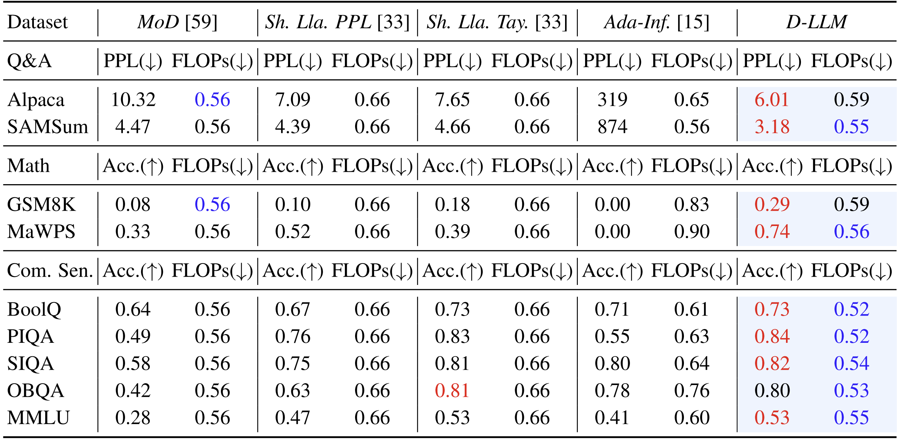

# D-LLM(WIP)

This repository is the official implementation of [D-LLM: A Token Adaptive Computing Resource Allocation Strategy for Large Language Models](https://openreview.net/pdf?id=UIOjGTKHQG). 

The implementation of algorithm is conducted on [Llama-2](https://github.com/Meta-Llama/llama?tab=readme-ov-file) currently.


## Requirements

To install requirements:

```setup
pip install -r requirements.txt
```

## Datasets
Datasets used in our work are all public and available on [Huggingface](https://huggingface.co/datasets). We recommend the following form to organize datasets:
```datasets_form
└─datasets
    ├─dataset_name_1
    |   ├─train.json
    |   ├─test.json
    |   └─prompt.json
    └─dataset_name_2
        ├─train.json
        ├─test.json
        └─prompt.json
```
Here we provide two instruction datasets currently as templates for reference: [Alpaca](https://huggingface.co/datasets/yahma/alpaca-cleaned) and [PIQA](https://huggingface.co/datasets/ybisk/piqa). In repository we provide datas as the demonstration with `test.json` for JSON format and `prompt.json` for prompt.


## Training

To train the model(s) in the paper, you should appropriate parameters in `finetuning.sh` including:

> - Path to where you place your LLMs' weights - `MODEL_PATH` and params - `MODEL_PARAM_PATH`
> - Path to where you place your datasets - `DATASET_PATH`
> - Main hyperparameters for model and training.

And then, run this command:

```train
bash finetuning.sh
```

## Inference

To inference based on trained D-LLMs, we provide a chat completion program as a demo. The instruction is organized in the prompt format of Alpaca in `example.py`. Run the following command to ask D-LLM on your own inputs, for example:

```inference
export CUDA_VISIBLE_DEVICE=0

torchrun --nproc_per_node 1 --master_port 9001 ./example.py \
    --llama_ckpt_dir /path/to/llama_ckpt \
    --dynamic_ckpt_dir /path/to/dllm_ckpt \
    --model_args_path /path/to/dllm_params \
    --tokenizer_path /path/to/llama_tokenizer \
    --instructs "['Tell me about the music in 1980s.', 'What is new wave?']"
```

You can list your questions as string list in parameter `instructs`. The program outputs answers for default instructions if you don't use parameter `instructs`.


## Results

We compare D-LLM with other block-wise pruning methods, including MoD, Shortened-Llama, Ada-Infer. We set the target of pruning ratio as 50% for training. D-LLM achieves siginificant improvements on following instruction finetuning benchmarks. Details are available in our paper.




## Contributing

>📋  Pick a licence and describe how to contribute to your code repository. 
